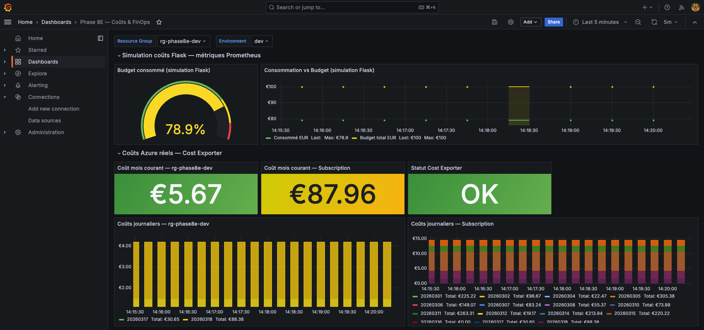
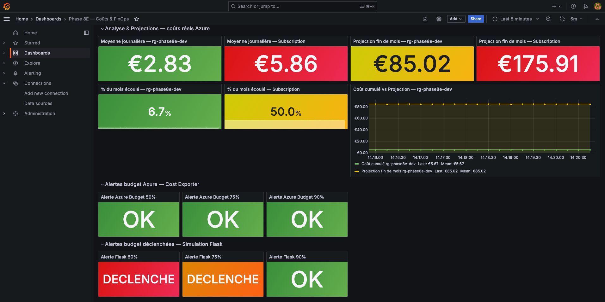
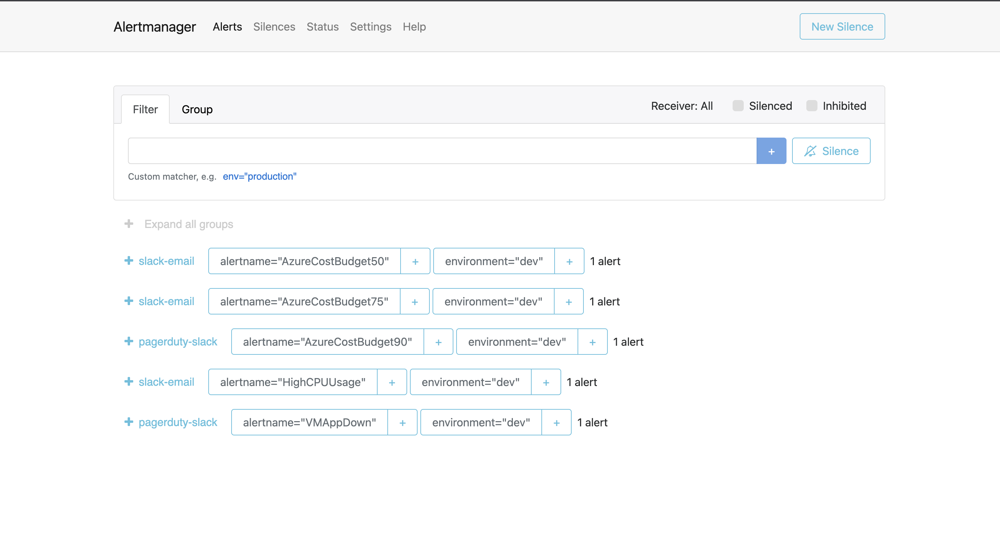

# Azure Cost Exporter pour Prometheus

[🇬🇧 Read in English](README.md)

Un exporteur Prometheus léger qui expose les **métriques réelles Azure Cost
Management** en utilisant l'**authentification par Managed Identity (MSI)**,
sans secrets, sans clés d'API et sans service principal.

> Il n'existe actuellement aucun plugin Grafana officiel ni exporteur open
> source pour Azure Cost Management en environnement auto-hébergé.
> Ce projet comble ce manque.

---

## Captures d'écran

### Dashboard des coûts : coûts Azure réels et détail journalier



### Dashboard des coûts : projections et alertes budget



### Alertmanager : routage des alertes budget



---

## Fonctionnalités

| Fonctionnalité                 | Description                                               |
| ------------------------------ | --------------------------------------------------------- |
| Authentification MSI           | Aucun secret à gérer ni à renouveler                      |
| Coûts par groupe de ressources | Totaux journaliers et mensuels par resource group         |
| Coûts par souscription         | Totaux journaliers et mensuels pour toute la souscription |
| Métrique de santé              | Visibilité immédiate sur l'état de l'exporteur            |
| Multi-environnement            | Label `environment` présent sur toutes les métriques      |
| Docker Compose                 | Prêt à l'emploi avec Prometheus et Grafana                |
| Dashboard Grafana              | Fichier JSON importable inclus dans le dépôt              |

---

## Métriques exposées

| Métrique                                  | Labels                                             | Description                              |
| ----------------------------------------- | -------------------------------------------------- | ---------------------------------------- |
| `azure_cost_rg_month_total_eur`           | subscription_id, resource_group, environment       | Coût mensuel du resource group           |
| `azure_cost_rg_daily_eur`                 | subscription_id, resource_group, environment, date | Coût journalier du resource group        |
| `azure_cost_subscription_month_total_eur` | subscription_id                                    | Coût mensuel de la souscription          |
| `azure_cost_subscription_daily_eur`       | subscription_id, date                              | Coût journalier de la souscription       |
| `azure_cost_scrape_success`               | resource_group, environment                        | 1 si le dernier scrape a réussi, 0 sinon |
| `azure_cost_scrape_timestamp_seconds`     | resource_group, environment                        | Horodatage du dernier scrape réussi      |

---

## Prérequis

### 1. Machine virtuelle Azure avec Managed Identity

L'exporteur doit s'exécuter sur une machine virtuelle Azure disposant d'une
Managed Identity assignée au système.

```bash
# Vérifier que la Managed Identity est activée sur la VM
az vm identity show \
  --resource-group <votre-resource-group> \
  --name <votre-vm>
```

### 2. Rôle Cost Management Reader

Assignez le rôle au niveau de la **souscription** afin que l'exporteur puisse
lire les coûts du resource group et de la souscription entière.

```bash
# Récupérer l'identifiant principal de la Managed Identity
PRINCIPAL_ID=$(az vm show \
  --resource-group <votre-resource-group> \
  --name <votre-vm> \
  --query "identity.principalId" -o tsv)

# Récupérer l'identifiant de la souscription
SUBSCRIPTION_ID=$(az account show --query "id" -o tsv)

# Assigner le rôle Cost Management Reader au niveau de la souscription
az role assignment create \
  --assignee "$PRINCIPAL_ID" \
  --role "Cost Management Reader" \
  --scope "/subscriptions/$SUBSCRIPTION_ID"
```

### 3. Fournisseur Microsoft.CostManagement

Le fournisseur Cost Management doit être enregistré sur votre souscription.

```bash
az provider register --namespace Microsoft.CostManagement
az provider show \
  --namespace Microsoft.CostManagement \
  --query "registrationState"
# Résultat attendu : Registered
```

> **Remarque :** Les données Azure Cost Management ont un délai de 24 à 48 heures
> après le déploiement des ressources. Les métriques peuvent ne retourner aucune
> donnée pendant les deux premiers jours suivant l'installation.

---

## Démarrage rapide

### 1. Cloner le dépôt

```bash
git clone https://github.com/<votre-nom-utilisateur>/azure-cost-exporter.git
cd azure-cost-exporter
```

### 2. Créer un fichier .env

```bash
cat > .env << EOF
SUBSCRIPTION_ID=<votre-identifiant-de-souscription>
RESOURCE_GROUP=<votre-resource-group>
ENVIRONMENT=dev
SCRAPE_INTERVAL=300
EOF
```

### 3. Démarrer la pile

```bash
docker compose up -d
```

### 4. Vérifier que les métriques sont disponibles

```bash
curl -s http://localhost:9101/metrics | grep azure_cost
```

Résultat attendu :

```
azure_cost_rg_month_total_eur{environment="dev",resource_group="mon-rg",subscription_id="..."} 12.45
azure_cost_subscription_month_total_eur{subscription_id="..."} 87.96
azure_cost_scrape_success{environment="dev",resource_group="mon-rg"} 1.0
```

---

## Dashboard Grafana

Un dashboard Grafana prêt à l'importation est inclus dans ce dépôt.

### Étapes d'importation

1. Ouvrir Grafana à l'adresse `http://localhost:3000`
2. Aller dans **Dashboards** puis **Import**
3. Cliquer sur **Upload JSON file**
4. Sélectionner le fichier `dashboard-costs.json` depuis ce dépôt
5. Sélectionner votre source de données Prometheus
6. Cliquer sur **Import**

### Sections du dashboard

| Section                | Panneaux                                                                                          |
| ---------------------- | ------------------------------------------------------------------------------------------------- |
| Coûts Azure réels      | Coût mensuel par resource group, coût mensuel souscription, statut de l'exporteur                 |
| Coûts journaliers      | Graphique en barres journalier par resource group, graphique par souscription                     |
| Analyse et projections | Moyenne journalière, projection fin de mois, pourcentage du mois écoulé, cumulé contre projection |
| Alertes budget         | Panneaux d'état pour les seuils 50 %, 75 % et 90 %                                                |

---

## Configuration

| Variable          | Obligatoire | Défaut | Description                                                   |
| ----------------- | ----------- | ------ | ------------------------------------------------------------- |
| `SUBSCRIPTION_ID` | Oui         | néant  | Identifiant de la souscription Azure                          |
| `RESOURCE_GROUP`  | Oui         | néant  | Resource group à surveiller                                   |
| `ENVIRONMENT`     | Non         | `""`   | Label ajouté à toutes les métriques (ex : dev, staging, prod) |
| `SCRAPE_INTERVAL` | Non         | `300`  | Intervalle de collecte en secondes                            |

---

## Architecture

```
Machine virtuelle Azure (Managed Identity activée)
  |
  |  GET http://169.254.169.254/metadata/identity/oauth2/token
  v
IMDS : Instance Metadata Service
  |
  |  Jeton OAuth2 (portée : management.azure.com)
  v
API Azure Cost Management
  POST /subscriptions/{id}/providers/Microsoft.CostManagement/query
  Période : BillingMonthToDate, granularité : Daily
  |
  |  Lignes de coûts journaliers par resource group et par souscription
  v
azure-cost-exporter :9101/metrics
  |
  v
Collecte Prometheus (toutes les 5 minutes)
  |
  v
Dashboard Grafana
```

---

## Exemples de requêtes PromQL

```promql
# Coût mensuel pour un resource group spécifique
azure_cost_rg_month_total_eur{resource_group="mon-rg"}

# Moyenne journalière du mois en cours (resource group)
azure_cost_rg_month_total_eur{resource_group="mon-rg"}
  / on(resource_group, environment)
  count by (resource_group, environment) (
    azure_cost_rg_daily_eur{resource_group="mon-rg"}
  )

# Projection de fin de mois
(
  azure_cost_rg_month_total_eur{resource_group="mon-rg"}
  / on(resource_group, environment)
  count by (resource_group, environment) (
    azure_cost_rg_daily_eur{resource_group="mon-rg"}
  )
) * 30

# Coût mensuel de la souscription
azure_cost_subscription_month_total_eur

# Vérification de la santé de l'exporteur
azure_cost_scrape_success == 0
```

---

## Règles d'alerte Prometheus (optionnel)

Ajoutez ces règles à votre configuration Prometheus pour déclencher des alertes
lorsque les coûts Azure dépassent les seuils budgétaires.

```yaml
groups:
  - name: azure_costs
    rules:
      - alert: AzureCostBudget50
        expr: |
          azure_cost_rg_month_total_eur
            / on(resource_group, environment)
          count by (resource_group, environment) (azure_cost_rg_daily_eur)
            * 30 > 50
        for: 5m
        labels:
          severity: warning
        annotations:
          summary: "Budget Azure à 50 % atteint : {{ $labels.resource_group }}"
          description: "Le coût projeté en fin de mois dépasse 50 % du budget."

      - alert: AzureCostBudget75
        expr: |
          azure_cost_rg_month_total_eur
            / on(resource_group, environment)
          count by (resource_group, environment) (azure_cost_rg_daily_eur)
            * 30 > 75
        for: 5m
        labels:
          severity: warning
        annotations:
          summary: "Budget Azure à 75 % atteint : {{ $labels.resource_group }}"
          description: "Le coût projeté en fin de mois dépasse 75 % du budget."

      - alert: AzureCostBudget90
        expr: |
          azure_cost_rg_month_total_eur
            / on(resource_group, environment)
          count by (resource_group, environment) (azure_cost_rg_daily_eur)
            * 30 > 90
        for: 5m
        labels:
          severity: critical
        annotations:
          summary: "Budget Azure à 90 % atteint : {{ $labels.resource_group }}"
          description: "Le coût projeté en fin de mois dépasse 90 % du budget. Action immédiate requise."
```

---

## Limitations

| Limitation                  | Détails                                                                 |
| --------------------------- | ----------------------------------------------------------------------- |
| Managed Identity uniquement | L'authentification par service principal n'est pas prise en charge      |
| Un seul resource group      | Surveille un seul resource group par instance                           |
| Devise EUR                  | Les métriques sont en euros, devise retournée par l'API Cost Management |
| Délai de données            | Azure Cost Management a un délai de 24 à 48 heures                      |
| Azure uniquement            | Conçu spécifiquement pour l'API Azure Cost Management                   |

---

## Surveiller plusieurs resource groups

Pour surveiller plusieurs resource groups, lancez une instance par resource
group avec des variables d'environnement différentes.

```yaml
# docker-compose.yml : plusieurs resource groups
services:
  cost-exporter-dev:
    build: .
    ports:
      - "9101:9101"
    environment:
      SUBSCRIPTION_ID: "${SUBSCRIPTION_ID}"
      RESOURCE_GROUP: "mon-rg-dev"
      ENVIRONMENT: "dev"

  cost-exporter-prod:
    build: .
    ports:
      - "9102:9101"
    environment:
      SUBSCRIPTION_ID: "${SUBSCRIPTION_ID}"
      RESOURCE_GROUP: "mon-rg-prod"
      ENVIRONMENT: "prod"
```

Ajoutez ensuite les deux cibles dans Prometheus :

```yaml
scrape_configs:
  - job_name: "azure-cost-exporter"
    scrape_interval: 5m
    scrape_timeout: 30s
    static_configs:
      - targets:
          - "cost-exporter-dev:9101"
          - "cost-exporter-prod:9101"
```

---

## Contribuer

Les contributions sont les bienvenues. N'hésitez pas à ouvrir une issue ou
à soumettre une pull request.

Les contributions sont particulièrement appréciées dans ces domaines :

- Prise en charge de devises supplémentaires
- Prise en charge de la Managed Identity assignée à l'utilisateur
- Exemples de requêtes PromQL supplémentaires
- Manifestes de déploiement Kubernetes (Deployment et ConfigMap)
- Chart Helm

---

## Licence

MIT : voir le fichier [LICENSE](LICENSE)
